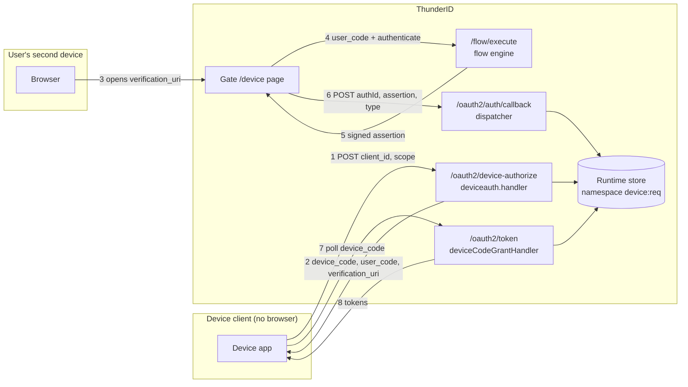

# OAuth 2.0 Device Authorization Grant Specification

- **Status:** Draft
- **Version:** 0.1
- **Related documents:**
  - [thunder-id/thunderid#5156](https://github.com/thunder-id/thunderid/issues/5156)
  - [RFC 8628: OAuth 2.0 Device Authorization Grant](https://datatracker.ietf.org/doc/html/rfc8628)
  - [RFC 8414: OAuth 2.0 Authorization Server Metadata](https://datatracker.ietf.org/doc/html/rfc8414)
  - [RFC 8707: Resource Indicators for OAuth 2.0](https://datatracker.ietf.org/doc/html/rfc8707)
  - [threat-model.md](threat-model.md)

## Summary

ThunderID supports no authorization flow for devices that cannot host a browser or accept
meaningful text input. Every current user-facing grant assumes the client can redirect the user
agent to `/oauth2/authorize` and receive the response back on the same device. Smart TVs, streaming
boxes, command-line tools, and similar constrained clients cannot satisfy that assumption, so
integrators either invent a non-standard mechanism, ask the user to type credentials on a remote
control, or do not use ThunderID at all.

This specification adds the OAuth 2.0 Device Authorization Grant (RFC 8628). A device client posts
to a new device authorization endpoint and receives a `device_code`, a short human-enterable
`user_code`, and a `verification_uri`. The user opens that URI on a phone or laptop, enters the
code, authenticates, and approves the request. Meanwhile the device polls the existing token
endpoint with `grant_type=urn:ietf:params:oauth:grant-type:device_code` until tokens are issued or
the request terminates.

The governing design decision is to **model the device grant on the existing CIBA implementation**
rather than introduce new machinery. CIBA is already a decoupled, poll-based grant with a
request-state machine, a runtime-store-backed record, and `authorization_pending` / `slow_down` /
`expired_token` / `access_denied` polling semantics. The device grant reuses that structure, the
shared flow engine, the shared `/oauth2/auth/callback` dispatcher, and the shared token endpoint.
Three things genuinely differ from CIBA and are designed explicitly below: the authentication flow
starts when the user redeems the code rather than at request time, the record carries a second
lookup key (`user_code`), and that second key needs brute-force protection that the codebase does
not currently provide for anything.

Scope covers the device authorization endpoint, the new grant handler, the user-facing verification
and approval page in the Gate application, discovery metadata, and per-client configuration.
Out of scope: push-mode delivery, `verification_uri_complete` QR rendering on the device itself
(ThunderID returns the URI; rendering is the client's concern), and any change to existing grants.

## Architecture

The feature adds one backend package and one Gate page, and extends five existing seams. No
component ownership boundary moves.



**New component.** `backend/internal/oauth/oauth2/deviceauth/` — a flat package mirroring
`ciba/`'s layout (`init.go`, `handler.go`, `service.go`, `store.go`, `model.go`,
`error_constants.go`). It owns the device authorization endpoint, the request record and its state
machine, and the user-code redemption logic. Its store is constructed internally and never exposed;
only `Initialize` and `DeviceAuthServiceInterface` leave the package.

**Existing seams extended.**

| Seam | File | Change |
|---|---|---|
| Grant type registry | [`providers/constants.go`](../../backend/pkg/thunderidengine/providers/constants.go) | Add `GrantTypeDeviceCode`; append to `SupportedGrantTypes` and `refreshTokenIssuingGrantTypes` |
| Runtime store namespace | [`providers/constants.go`](../../backend/pkg/thunderidengine/providers/constants.go) | Add `NamespaceDeviceAuth = "device:req"` |
| Grant handler dispatch | [`granthandlers/provider.go`](../../backend/internal/oauth/oauth2/granthandlers/provider.go) | Struct field, conditional construction, `switch` case |
| Flow callback dispatch | [`callback/callback.go`](../../backend/internal/oauth/oauth2/callback/callback.go) | New `case` for the device grant type |
| Discovery metadata | [`discovery/service.go`](../../backend/internal/oauth/oauth2/discovery/service.go) | Conditional `device_authorization_endpoint` |

**Reused without change.** Client authentication middleware (including the `none` method for public
clients), DPoP verification (performed by the token service before the grant handler runs), resource
indicators, the attribute cache, the token builder, the observability event pipeline, and the
existing `authorization_pending` / `slow_down` / `expired_token` / `access_denied` error constants,
all of which were added for CIBA and are reused verbatim.

## Detailed design

### Device authorization request

`POST /oauth2/device-authorize` is registered behind `clientauth.ClientAuthMiddleware` and
wrapped with CORS, exactly as `/oauth2/bc-authorize` is. Unlike CIBA, an `OPTIONS` route is also
registered, matching the newer endpoints (`/oauth2/introspect`, `/oauth2/revoke`, `/oauth2/dcr`).

The handler parses the form, reads the authenticated client from the request context, and validates
that the client is permitted the device grant via `oauthApp.IsAllowedGrantType`. The service then:

1. Generates a `device_code` — 32 bytes from `crypto/rand`, base64url-encoded without padding,
   via a new `DeviceCodeCredential` case on the existing `generateOAuth2Credential` helper. UUIDv7
   is deliberately **not** used: it embeds a timestamp and carries only 74 bits of entropy, which is
   acceptable for CIBA's `auth_req_id` (additionally bound to an authenticated client) but not for a
   value a public client presents as its sole proof of the pending grant.
2. Generates a `user_code` — see [User code generation and redemption](#user-code-generation-and-redemption).
3. Resolves the requested scopes and, when a `resource` parameter is present, the resource-server
   binding, using the same `resourceindicators` helpers the CIBA path uses.
4. Stores the record with a TTL derived from its expiry, and returns the response.

The response is `Cache-Control: no-store`:

```json
{
  "device_code": "GmRhm...",
  "user_code": "WDJB-MJHT",
  "verification_uri": "https://thunderid.example.com/gate/device",
  "verification_uri_complete": "https://thunderid.example.com/gate/device?user_code=WDJB-MJHT",
  "expires_in": 600,
  "interval": 5
}
```

The authentication flow is **not** started here. CIBA can start its flow at request time because
`login_hint` names the user; a device request identifies no user, so there is nothing to
authenticate until someone redeems the code. The record is therefore written first and the flow is
initiated during redemption. This reverses CIBA's ordering and is the one structural divergence
from that template.

### Request record and state machine

The record is stored in the runtime store under a single namespace, `device:req`, serialized as
JSON with no struct tags so that the `State` field name is the literal JSON key required by
`CompareFieldAndSwap`.

```go
type DeviceAuthRequest struct {
	DeviceCode       string
	UserCode         string
	ClientID         string
	UserID           string
	StandardScopes   string
	AuthorizedScopes string
	Resources        []string
	State            DeviceRequestState
	AttributeCacheID string
	CompletedACR     string
	AuthTime         time.Time
	LastPolledAt     time.Time
	PollInterval     int64
	UserCodeAttempts int
	ExpiryTime       time.Time
}
```

States and their token-endpoint meaning:

| State | Set by | Token endpoint result |
|---|---|---|
| `PENDING` | Device authorization request | `authorization_pending` (or `slow_down`) |
| `APPROVED` | Callback, on a successful assertion | Tokens issued, then `CONSUMED` |
| `CONSUMED` | Token issuance | `invalid_grant` |
| `DENIED` | Callback, on an end-user error assertion | `access_denied` |
| `FAILED` | Callback, on a server error assertion | `server_error` |
| `EXPIRED` | Lazily, by the token endpoint | `expired_token` |

Expiry is enforced at three layers, as it is for CIBA: the store TTL removes the row, every
runtime-store read filters on `EXPIRY_TIME`, and the grant handler checks `ExpiryTime` before
inspecting state. No background reaper is introduced; the existing out-of-band
`cleanup_expired_runtime_transient_data` procedure already covers the whole `RUNTIME_STORE` table.

All security-relevant transitions use `CompareFieldAndSwap` on the `State` field rather than
read-modify-write, so concurrent polling and a concurrent approval cannot interleave into a double
issuance.

### User code generation and redemption

The `user_code` is typed by a human, so it trades entropy for legibility. ThunderID uses the
character set RFC 8628 §6.1 recommends — the 20 uppercase consonants `BCDFGHJKLMNPQRSTVWXZ`, which
excludes vowels (so no code spells a word) and excludes digits and visually ambiguous glyphs. Eight
characters are drawn with `crypto/rand` and displayed hyphenated as `XXXX-XXXX`, giving
20^8 ≈ 2.56 × 10^10 possible codes.

Because the user code must be looked up independently of the device code, the record is indexed
twice within the one namespace, following the key-prefix convention already used for authorization
code replay markers:

- `<device_code>` → the full serialized record
- `usercode:<normalized_user_code>` → the device code

Both entries carry the same TTL. The index is claimed with `PutIfNotExists`, so a generated code
that collides with a live one is detected atomically and regenerated (bounded at five attempts,
after which the request fails with `server_error`). Normalization before lookup uppercases the
input and strips hyphens and whitespace, so the user may type the code in any case and with or
without the separator.

Using one namespace with a prefix rather than two namespaces keeps the Postgres partition list to a
single added entry and matches existing precedent.

### Brute-force protection on the user code

A `user_code` is a short, guessable, user-presented secret, and RFC 8628 §5.1 requires the server to
resist brute-force attempts against it. **The codebase provides no rate-limiting or lockout
primitive of any kind** — there is no limiter middleware, no account-lockout mechanism, and no
throttling infrastructure to build on. This control is therefore designed from scratch here, and it
is the one place this feature adds a genuinely new mechanism rather than reusing an existing one.

Protection operates at two levels.

**Per-request attempt counting.** `UserCodeAttempts` on the record bounds how many times a single
pending request may be targeted. This is a direct analogue of the OTP executor's `attemptCount`,
the only existing "N strikes" control in the codebase. It does not by itself defend against an
attacker spraying random codes across many requests.

**Per-session redemption throttling.** The verification page holds a redemption context keyed to the
browser session. After five failed redemption attempts within that context the page refuses further
attempts for a configurable cooldown, and every failure — whether the code is unknown, expired, or
already used — returns one indistinguishable response, so an attacker learns nothing about which
codes exist.

Both bounds are configurable (see [Configuration](#configuration)). The threat model records the
residual risk that a distributed attacker across many sessions is bounded only by the code space
and the short request lifetime, and the reasoning for accepting it.

### User verification and approval

The user opens `verification_uri` on a browser-capable device and lands on a new Gate page at
`/device`. The page follows the imperative pattern established by `SignOutBox` (raw `fetch` against
`/flow/execute`) rather than the SDK-driven pattern, because the flow is entered from a bare URL
with no prior execution context.

The sequence is:

1. **Code entry.** The page renders a user-code field. When `verification_uri_complete` was used,
   `user_code` arrives as a query parameter and the field is pre-filled, leaving the user only to
   confirm. The existing `OtpInputAdapter` provides segmented code entry; `TimerAdapter` renders the
   expiry countdown. No new flow adapters are required.
2. **Redemption.** The page posts the code to the deviceauth service, which normalizes it, resolves
   the index entry, and confirms the record is `PENDING` and unexpired. On success it calls
   `flowExecService.InitiateFlow` with `RuntimeKeyAuthorizationRequestID` set to the device code
   and `RuntimeKeyCallbackType` set to the device grant type, and returns the resulting
   `executionId` and `authId`.
3. **Authentication.** The page drives `/flow/execute` exactly as the sign-out page does, rendering
   each step through `FlowComponentRenderer`. Because the page runs in a normal browser, the
   per-flow SSO cookie applies: a user with a live session for the application's authentication flow
   is carried through by the existing SSO-Check node without re-authenticating.
4. **Approval.** The flow's terminal prompt shows the requesting application and the scopes being
   granted, with `CONFIRM` and `REJECT` actions. Where the application's flow includes a
   `ConsentExecutor` node, the existing `ConsentAdapter` renders per-scope consent and the approval
   step is that consent screen; no device-specific consent mechanism is introduced.
5. **Completion.** On a terminal flow status the page posts `{authId, assertion, type}` to
   `/oauth2/auth/callback`. The dispatcher routes on `type` to the deviceauth service, which
   verifies the assertion signature **before** loading the record, decodes the claims, confirms
   `authorization_request_id` matches the device code, and transitions the record to `APPROVED`
   (or `DENIED` / `FAILED` for an error assertion). Like CIBA and unlike the authorization code
   flow, the response is a flat acknowledgement with no redirect: the device is polling and there is
   no browser to send anywhere.

Ordering in step 5 is load-bearing and mirrors the authorization-code path: verifying the signature
first prevents an unverified assertion from consuming a live request, and checking the
`authorization_request_id` binding prevents an assertion minted for one device request from
approving another.

### Token issuance and polling

The device client polls `POST /oauth2/token` with `grant_type=urn:ietf:params:oauth:grant-type:device_code`
and its `device_code`. A `DeviceCode` field is added to `model.TokenRequest` and read from the form
in the token handler.

`ValidateGrant` confirms the grant type matches, the `device_code` is present and resolvable, and —
critically — that `record.ClientID` equals the authenticated client, so one client cannot poll
another's device code. Resource parameters supplied at poll time may not widen the stored binding.

`HandleGrant` checks expiry first, then switches on state per the table above. Token issuance
follows the CIBA recipe: resolve audiences and scopes, hydrate attributes from the attribute cache,
build the access token (with the DPoP thumbprint when present, and an `act` claim where the client
warrants one), add an ID token when `openid` was granted, and finally mark the record `CONSUMED`
through an atomic compare-and-swap. A losing racer receives `invalid_grant`.

Refresh tokens are issued when the client also holds the `refresh_token` grant, which requires
adding the device grant to `refreshTokenIssuingGrantTypes`. Device clients are precisely those for
which re-authentication is most costly, so this is the expected configuration. The parallel
frontend constant `REFRESH_TOKEN_ISSUING_GRANTS` must be updated in step.

**Polling interval.** The interval is stored per record rather than read from a global constant, so
a deployment can tune it and so a future per-client interval needs no record migration.
`LastPolledAt` is advanced on every poll of a `PENDING` record and compared against the interval to
decide between `slow_down` and `authorization_pending`.

This is the one place the design deliberately departs from CIBA's implementation. CIBA rewrites the
whole record on every poll to track `LastPolledAt`; at CIBA's 120-second lifetime that is roughly
24 writes per request, but at the device grant's default 600-second lifetime it would be about 120
writes per device, and RFC 8628 permits far longer lifetimes still. The device grant instead
persists `LastPolledAt` only when the value would actually change the `slow_down` decision — that
is, when the poll is accepted — so a client polling correctly at the interval writes once per
interval, and a client polling abusively fast is rejected without a write per attempt. Correctness
is unchanged; a store failure during this update is logged and the poll proceeds, degrading to no
throttling rather than to no service, as CIBA does.

### Data model

No new table and no migration. Device authorization requests live in the existing partitioned
`RUNTIME_STORE` key-value table as short-lived, TTL-bounded JSON documents, the same as CIBA
requests, PAR requests, and authorization codes.

One schema change is required. `RUNTIME_STORE` is `PARTITION BY LIST (NAMESPACE)` in PostgreSQL, and
the schema states that adding a namespace constant requires a matching partition. So
[`dbscripts/runtime_transient/postgres.sql`](../../backend/dbscripts/runtime_transient/postgres.sql)
gains one line:

```sql
CREATE TABLE "RUNTIME_STORE_DEVICE_REQ" PARTITION OF "RUNTIME_STORE" FOR VALUES IN ('device:req');
```

SQLite is unpartitioned and needs no change. Because the repository has no migration framework and
schema files are edited in place, operators upgrading an existing PostgreSQL deployment must apply
this `CREATE TABLE` statement manually; this is called out in the release note.

Client grant types are persisted as JSONB within `OAUTH_INBOUND_PROFILE.OAUTH_CONFIG`, so recording
the new grant type against an application requires no schema change.

### API

**`POST /oauth2/device-authorize`** — client-authenticated, `application/x-www-form-urlencoded`.

| Parameter | Required | Notes |
|---|---|---|
| `client_id` | For public clients | Confidential clients authenticate normally |
| `scope` | No | Space-delimited |
| `resource` | No | RFC 8707; at most one, binds the request to one resource server |

Success is `200` with the body shown earlier. Errors follow the standard OAuth shape
(`{"error", "error_description"}`) with `invalid_client` → 401, `server_error` → 500, and everything
else → 400.

**`POST /oauth2/token`** — existing endpoint, new `grant_type`.

| Parameter | Required |
|---|---|
| `grant_type` | Yes, `urn:ietf:params:oauth:grant-type:device_code` |
| `device_code` | Yes |
| `client_id` | For public clients |

| Error | Condition | Client action |
|---|---|---|
| `authorization_pending` | User has not yet acted | Retry after the interval |
| `slow_down` | Polling faster than the interval | Increase the interval by 5s, then retry |
| `access_denied` | User denied the request | Stop polling |
| `expired_token` | `device_code` expired | Stop polling |
| `invalid_grant` | Unknown, already-consumed, or another client's `device_code` | Stop polling |

All five are HTTP 400, per RFC 8628 §3.5.

**Discovery.** Both `/.well-known/oauth-authorization-server` and `/.well-known/openid-configuration`
gain `device_authorization_endpoint` when the grant is enabled, and
`urn:ietf:params:oauth:grant-type:device_code` appears in `grant_types_supported` automatically once
the constant joins `SupportedGrantTypes`.

The OpenAPI definitions in `api/oauth2.yaml`, `api/discovery.yaml`, `api/application.yaml`, and
`api/agent.yaml` are updated to match.

### UI

One new Gate page at `/device`, registered in `RouteConfig` and `App.tsx` alongside the existing
routes, and backed by a `DevicePath` field on `GateClientConfig` defaulting to
`urlpath.Join(Path, "device")`.

The page has three states, wireframed below. These wireframes fix the content and the actions of
each screen; visual design is settled during implementation against the existing `AuthCardLayout`
and the Gate's other pages.

**Code entry** — a single segmented field and a submit action, pre-filled and awaiting confirmation
when reached via `verification_uri_complete`.

```
+--------------------------------------------------+
|                  [ App logo ]                    |
|              Connect your device                 |
|   Enter the code shown on your device to continue|
|                                                  |
|        +---+ +---+ +---+ +---+   +---+ ...       |
|        | W | | D | | J | | B | - | M | ...       |
|        +---+ +---+ +---+ +---+   +---+ ...       |
|                                                  |
|              [      Continue      ]              |
|                                                  |
|                Expires in 9:47                   |
+--------------------------------------------------+
```

**Authentication** — whatever steps the application's flow defines, rendered through the existing
`FlowComponentRenderer`. This page contributes no authentication UI of its own.

**Approval** — the requesting application, the scopes requested, and two actions. Where the flow
includes a consent node, this step is the existing consent screen instead.

```
+--------------------------------------------------+
|                  [ App logo ]                    |
|          Living Room TV wants access             |
|             Signed in as ada@example.com         |
|                                                  |
|   This will allow Living Room TV to:             |
|     - View your basic profile                    |
|     - View your email address                    |
|                                                  |
|      [   Deny   ]        [    Allow    ]         |
+--------------------------------------------------+
```

Terminal outcomes — approved, denied, expired, and too many attempts — render as plain confirmation
text, each telling the user they may return to the device. The page never redirects.

Strings are added as a `device:` namespace in the backend translation resource, consistent with how
`signout:` is supplied, so flow-owned prompts and page chrome resolve through the same mechanism.

### Configuration

A `DeviceConfig` block under `oauth`, alongside `CIBAConfig` and `PARConfig`, with defaults in
`default.json` and a `Validate()` registered in the explicit validation list.

| Key | Default | Purpose |
|---|---|---|
| `oauth.device.expires_in` | `600` | Device code lifetime, seconds |
| `oauth.device.interval` | `5` | Minimum seconds between polls |
| `oauth.device.user_code_length` | `8` | Characters, excluding the separator |
| `oauth.device.max_user_code_attempts` | `5` | Failed redemptions per request before it is abandoned |
| `oauth.device.max_redemption_attempts` | `5` | Failed redemptions per browser session before cooldown |
| `oauth.device.redemption_cooldown_seconds` | `300` | Cooldown after the session limit is hit |

All are deployment-level. Validation rejects a non-positive `expires_in` or `interval`, a
`user_code_length` below 6, and non-positive attempt limits, naming the full config path in the
error as the existing validators do.

The grant is gated deployment-wide by `oauth.allowed_grant_types` — the service is not constructed
at all when the grant is absent — and per client by the client's own `grantTypes`.

**One existing validation rule must be relaxed.** Application creation currently rejects any public
client that does not hold `authorization_code`:

```go
if oauthAppConfig.PublicClient &&
    !slices.Contains(oauthAppConfig.GrantTypes, providers.GrantTypeAuthorizationCode) {
    return nil, &ErrorNativeFlowNotAllowedForSPA
}
```

The rule exists to stop browser SPAs from using direct native flow execution, but it also blocks the
central RFC 8628 case: a TV or CLI registering as a public client with only the device grant.

The condition gains a disjunct for the device grant, so a public client must hold
`authorization_code` **or** the device grant:

```go
if oauthAppConfig.PublicClient &&
    !slices.Contains(oauthAppConfig.GrantTypes, providers.GrantTypeAuthorizationCode) &&
    !slices.Contains(oauthAppConfig.GrantTypes, providers.GrantTypeDeviceCode) {
    return nil, &ErrorNativeFlowNotAllowedForSPA
}
```

A public client holding neither is still rejected, so the original protection against SPAs
configured for direct native flow execution is preserved rather than removed. The existing test
asserting the current rejection stays valid and is joined by one covering the new disjunct
(AC5.3 and AC6.2).

This is a deliberate change to existing security-relevant validation, and the threat model
analyses it as threat 23. The
`none` token-endpoint authentication method is already permitted for public clients and needs no
change; the device grant is not added to the restrictions that exclude `client_credentials` and
`jwt-bearer` from it, because RFC 8628 is designed for exactly these clients.

## Requirements

### R1. Device authorization request

**Requirement:** A device client can initiate authorization and receive the codes and metadata it
needs to instruct the user and begin polling.

**Acceptance criteria:**

- **AC1.1:** Given a client permitted the device grant, when it posts to
  `/oauth2/device-authorize`, then the response is `200` and contains `device_code`, `user_code`,
  `verification_uri`, `expires_in`, and `interval`.
- **AC1.2:** Given such a request, when the response is returned, then it also contains
  `verification_uri_complete` carrying the user code as a query parameter.
- **AC1.3:** Given a client whose configured grant types exclude the device grant, when it posts to
  the endpoint, then the response is `400` with `unauthorized_client`.
- **AC1.4:** Given a deployment whose `oauth.allowed_grant_types` omits the device grant, when a
  client posts to the endpoint, then the route is not registered and the response is `404`.
- **AC1.5:** Given two device authorization requests, when both are issued, then their `device_code`
  values differ and each carries at least 256 bits of entropy.
- **AC1.6:** Given a request carrying more than one `resource` parameter, when it is processed, then
  the response is `400` with `invalid_target`.

### R2. User verification and approval

**Requirement:** A user can redeem a user code on a second device, authenticate, and approve or deny
the request.

**Acceptance criteria:**

- **AC2.1:** Given a pending request, when the user submits its `user_code` at the verification page,
  then an authentication flow starts and the page renders its first step.
- **AC2.2:** Given a user code typed in lowercase, without hyphens, or with surrounding whitespace,
  when it is submitted, then it resolves to the same request as its canonical form.
- **AC2.3:** Given the user has authenticated, when they approve the request, then the record moves
  to `APPROVED` and the page confirms they may return to the device.
- **AC2.4:** Given the user has authenticated, when they deny the request, then the record moves to
  `DENIED`.
- **AC2.5:** Given a user with a live SSO session for the application's authentication flow, when
  they redeem a code, then they reach the approval step without re-authenticating.
- **AC2.6:** Given a user code that is unknown, expired, or already redeemed, when it is submitted,
  then the page returns one indistinguishable failure message for all three cases.
- **AC2.7:** Given `verification_uri_complete` was opened, when the page loads, then the code field
  is pre-filled and the user need only confirm.

### R3. Token issuance by polling

**Requirement:** A device client polling the token endpoint receives the correct state signal, and
tokens exactly once, after approval.

**Acceptance criteria:**

- **AC3.1:** Given a `PENDING` request, when the client polls at or above the interval, then the
  response is `400` with `authorization_pending`.
- **AC3.2:** Given a `PENDING` request polled more recently than the interval, when the client polls
  again, then the response is `400` with `slow_down`.
- **AC3.3:** Given an `APPROVED` request, when the client polls, then the response is `200` with an
  access token, and an ID token when `openid` was granted.
- **AC3.4:** Given a request whose tokens were already issued, when the client polls again, then the
  response is `400` with `invalid_grant`.
- **AC3.5:** Given a `DENIED` request, when the client polls, then the response is `400` with
  `access_denied`.
- **AC3.6:** Given a request past its expiry, when the client polls, then the response is `400` with
  `expired_token`, regardless of prior state.
- **AC3.7:** Given a device code issued to one client, when a different authenticated client polls
  with it, then the response is `400` with `invalid_grant`.
- **AC3.8:** Given an `APPROVED` request, when two clients poll concurrently, then exactly one
  receives tokens and the other receives `invalid_grant`.
- **AC3.9:** Given a client that also holds the `refresh_token` grant, when tokens are issued, then
  the response includes a refresh token.

### R4. Brute-force resistance on the user code

**Requirement:** User codes resist guessing.

**Acceptance criteria:**

- **AC4.1:** Given a request that has reached `max_user_code_attempts` failed redemptions, when its
  user code is submitted again, then redemption fails even if the code is correct.
- **AC4.2:** Given a browser session that has reached `max_redemption_attempts` failures, when it
  submits another code, then the attempt is refused for `redemption_cooldown_seconds`.
- **AC4.3:** Given a generated user code, when it is inspected, then it contains only characters
  from the 20-consonant set and no vowels or digits.
- **AC4.4:** Given a user code that collides with a live one, when it is generated, then a different
  code is issued and no existing request is overwritten.

### R5. Discovery and configuration

**Requirement:** Device grant support is discoverable, and configurable per deployment and per
client.

**Acceptance criteria:**

- **AC5.1:** Given the grant is enabled, when the discovery document is fetched, then
  `grant_types_supported` includes `urn:ietf:params:oauth:grant-type:device_code` and
  `device_authorization_endpoint` is present.
- **AC5.2:** Given the grant is disabled, when the discovery document is fetched, then neither the
  grant type nor the endpoint appears.
- **AC5.3:** Given a public client registered with only the device grant, when it is created, then
  creation succeeds.
- **AC5.4:** Given `oauth.device.expires_in` is configured, when a device authorization request is
  made, then the returned `expires_in` reflects it.
- **AC5.5:** Given an invalid device configuration value, when the server starts, then startup fails
  with an error naming the full configuration path.

### R6. Existing behavior preserved

**Requirement:** Applications that do not use the device grant are unaffected.

**Acceptance criteria:**

- **AC6.1:** Given the existing OAuth and OIDC integration test suites, when they run with the device
  grant enabled, then all pass unchanged.
- **AC6.2:** Given a public SPA registered without the device grant and without
  `authorization_code`, when it is created, then creation is still rejected.
- **AC6.3:** Given a CIBA request, when it is polled, then its behavior is unchanged.

## Change log

| Version | Date | Change |
|---|---|---|
| 0.1 | 2026-09-11 | Initial specification. |
