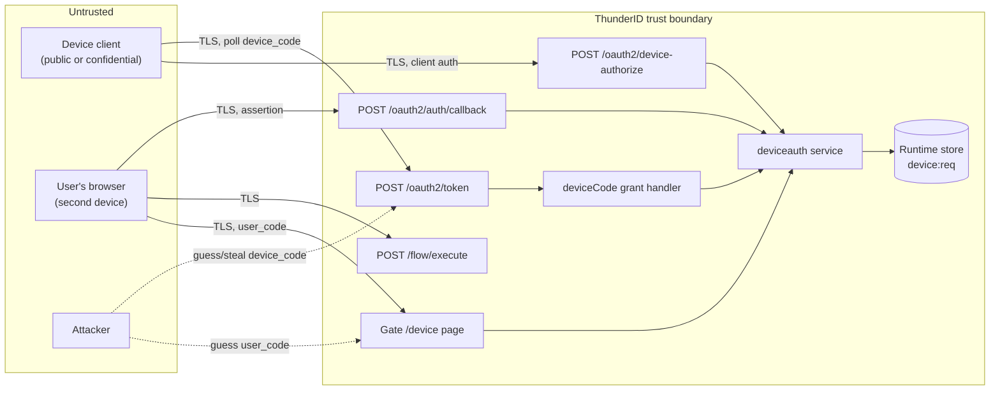
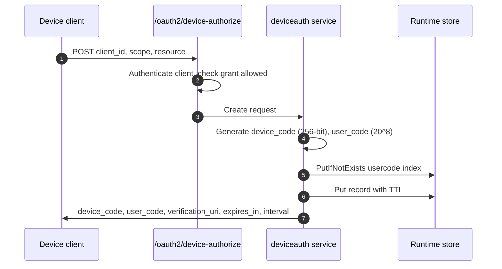
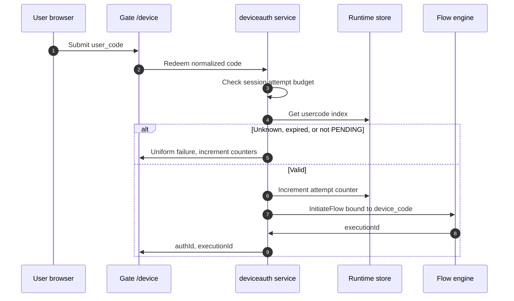
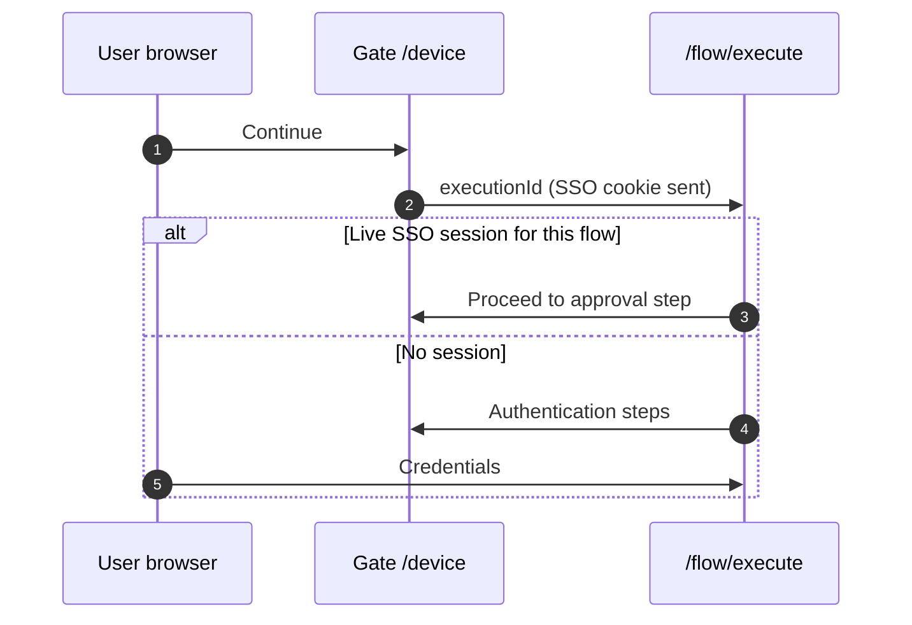
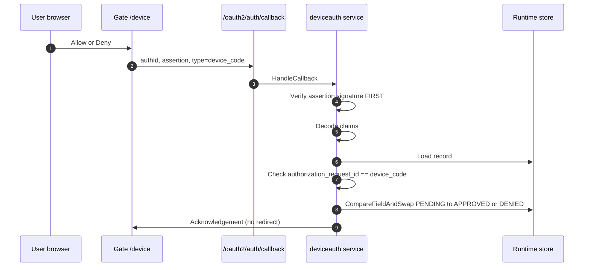
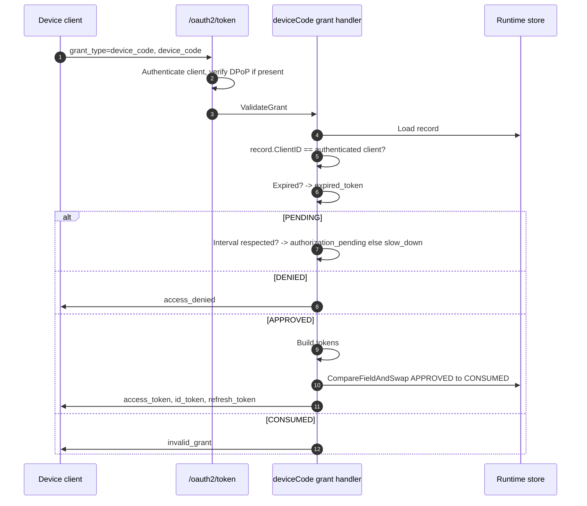
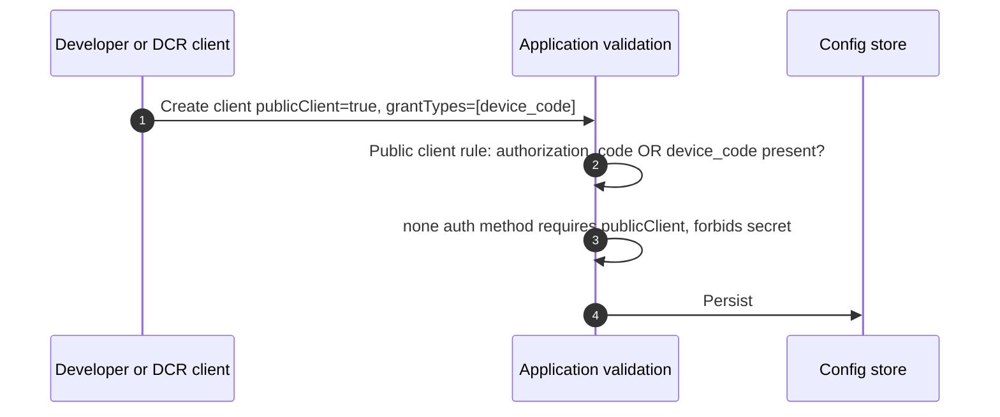

# Device Authorization Grant Threat Model

This model covers the OAuth 2.0 Device Authorization Grant (RFC 8628) as specified in
[spec.md](spec.md): the device authorization endpoint, the device request record and its state
machine, the user-facing verification and approval page, and the device code grant at the token
endpoint.

## Overview

The device grant splits one authorization across two devices that share no channel. A constrained
client (a TV, a CLI) obtains a `device_code` it keeps secret and a `user_code` it shows on screen;
the user carries that short code to a browser on a second device, authenticates, and approves. The
security of the flow rests on three things: the `device_code` being unguessable and bound to the
client that requested it, the `user_code` being resistant to guessing despite being short and
human-readable, and the approval being bound to the specific request the user was shown.

The entry points are `POST /oauth2/device-authorize` (client-authenticated), the Gate
verification page at `/device` (unauthenticated until the user signs in), `POST /flow/execute` and
`POST /oauth2/auth/callback` (shared with other grants), and `POST /oauth2/token`
(client-authenticated).

The distinguishing security property of this grant, relative to every other grant ThunderID
supports, is that **the user approves a request they did not initiate in the browser they are
using**. Nothing in the browser's own context proves the request is the one displayed on the
device. That asymmetry is the root of the phishing threat analysed in [04](#04-device-approval).

Cross-cutting concerns covered elsewhere: client authentication (including `private_key_jwt`
assertion validation and JTI replay protection), token signing and key management, DPoP proof
verification, the flow engine's own authentication mechanisms and assertion minting, SSO session
establishment and lifetime, and consent recording. These are referenced here as trust inputs and
are not re-analysed.

## Scope

This model covers:

- The device authorization request and the generation, storage, and lifetime of `device_code` and
  `user_code`.
- User code redemption at the verification page, including brute-force resistance.
- The approval and denial decision, and its binding to the device request.
- The flow callback that records the decision.
- Device code polling at the token endpoint, and token issuance.
- The relaxation of the public-client registration rule described in the specification.

Out of scope (see the referenced companion models):

- How the user authenticates once redemption has started — owned by the authentication flow model.
- Client authentication mechanics at the device authorization and token endpoints — owned by the
  client authentication model.
- Access, refresh, and ID token content, signing, and validation — owned by the token issuance model.
- Consent capture and persistence — owned by the consent model.
- SSO session establishment, cookie handling, and termination — owned by the session model.
- Revocation of tokens after issuance — owned by the revocation model.

## Architecture



### Components

The device grant adds one service package and one browser page, and reuses the existing token,
flow, and callback infrastructure.

| Component | Task |
| --- | --- |
| Device authorization endpoint | Authenticates the client, validates the grant is permitted, generates `device_code` and `user_code`, creates the `PENDING` record. Returns `Cache-Control: no-store`. |
| deviceauth service | Owns code generation, the user-code index, redemption, and state transitions. Enforces attempt limits. The store is internal and never exposed. |
| Device request record | Short-lived JSON in the runtime store under `device:req`, TTL-bounded. Holds the state, the client binding, resolved scopes, and attempt counters. Indexed twice: by device code and by `usercode:` prefix. |
| Gate verification page | Unauthenticated entry point. Accepts the user code, drives the authentication flow, renders the approval step, relays the assertion to the callback. Never redirects. |
| Flow callback dispatcher | Shared endpoint. Routes by `type` to the deviceauth service. Carries no client authentication; security rests on assertion signature plus request binding. |
| Device code grant handler | Validates the device code resolves and belongs to the polling client, enforces expiry, interval, and state, issues tokens, and consumes the record atomically. |
| Runtime store | TTL-bounded key-value persistence with `PutIfNotExists` for atomic index claiming and `CompareFieldAndSwap` for race-free state transitions. |

### Actors

#### Actors

| Actor | Description | Roles or permissions |
| --- | --- | --- |
| End user | Authenticates on a second device and approves or denies the device's request. | Whatever the approved scopes convey; no ThunderID administrative role is required. |
| Device client | Constrained OAuth client. Initiates the request, displays the user code, polls for tokens. Commonly a public client that cannot hold a secret. | Only the grant types and scopes configured on it. |
| Application developer | Registers and configures the client, including whether it is public and which grants it holds. | Application management permissions in the Console or DCR. |
| ThunderID | Generates and manages device requests, authenticates the user, records the decision, issues tokens. | Full authority over the request record and token issuance. |
| Attacker (unauthenticated) | Attempts to guess user codes, guess or steal device codes, or induce a user to approve a request the attacker initiated. | None. |

#### Entitlement matrix

| Actor | Initiate device request | Redeem a user code | Approve or deny | Obtain tokens for a device code |
| --- | --- | --- | --- | --- |
| End user | [No] | [Yes] | [Yes] | [No] |
| Device client (grant configured) | [Yes] | [No] | [No] | [Yes] — only for its own device code, once approved |
| Device client (grant not configured) | [No] | [No] | [No] | [No] |
| Application developer | [Yes] — as a configured client | [No] | [No] | [No] |
| Attacker (unauthenticated) | [No] | [No] | [No] | [No] |

### External Dependencies (not owned)

| Dependency | Description (usage, purpose, authentication, authorization, security) |
| --- | --- |
| Runtime store (PostgreSQL, SQLite, or Redis) | Holds device request records and the user-code index with TTLs. Must provide atomic `PutIfNotExists` and `CompareFieldAndSwap`; correctness of one-time issuance depends on it. Owned by the runtime store implementation. |
| Flow engine | Authenticates the user and mints the signed assertion carrying the approval decision. Owned by the authentication flow model. |
| Client authentication middleware | Authenticates the client at the device authorization and token endpoints, including the `none` method for public clients. Owned by the client authentication model. |
| Token builder and signing keys | Mints access, refresh, and ID tokens after approval. Owned by the token issuance model. |
| TLS termination | All interactions assume TLS. Device codes and user codes are bearer material and are not separately encrypted in transit. Owned by the deployment. |

## Threats and mitigations

### Out-of-scope interactions and risks

- Compromise of the user's authentication credentials during the flow — owned by the authentication
  flow model.
- Theft or misuse of tokens after issuance, including refresh token replay — owned by the token
  issuance and revocation models.
- Forgery of the flow assertion through signing key compromise — owned by the key management model.
- Consent record tampering — owned by the consent model.
- Cookie theft granting an attacker a live SSO session — owned by the session model.

### Interactions

#### 01: Device authorization request

**Description**

A device client posts to `/oauth2/device-authorize`. The client is authenticated by the shared
middleware (or identified by `client_id` alone when it is a public client). The service validates
that the client holds the device grant, generates a 256-bit `device_code` and an 8-character
`user_code`, claims the user-code index entry with `PutIfNotExists`, and stores a `PENDING` record
with a TTL. No user is identified and no authentication flow starts.

**Assets involved**

| Initiator | Intermediate | Target |
| --- | --- | --- |
| Device client credentials (or bare `client_id`) | Device authorization endpoint, deviceauth service | Device request record, `device_code`, `user_code` |

**Data flow**



**Security considerations**

| Area | Response | Comments |
| --- | --- | --- |
| Data confidentiality | [C-High] | `device_code` is bearer material for a pending grant; `user_code` is a short-lived shared secret. |
| Communication medium | [M-NT] | |
| Transport security | [TLS] | |
| Authentication | Client authentication middleware; `none` for public clients | |
| Accessibility | [Public] | Reachable by any party that can present a valid `client_id`. |
| Authorization and Access Control | Grant type must be permitted deployment-wide and on the client | |

**Threat assessment**

| ID | Category | Threat | Materializable | Mitigation / comment |
| --- | --- | --- | --- | --- |
| 1 | [Spoofing] | An attacker knowing only a public client's `client_id` initiates device requests in its name. A `client_id` is not secret, so this cannot be prevented for public clients. The resulting request is useless without a user approving it, but it consumes storage and can be used to mount the phishing attack in [04](#04-device-approval). | [No] | Accepted as inherent to RFC 8628 with public clients. Impact is bounded: the record is TTL-limited, holds no user data until approval, and tokens are issued only to the client the code was issued to (threat [11](#05-device-code-polling-and-token-issuance)). |
| 2 | [Denial of Service] | Unauthenticated or weakly identified request flooding exhausts runtime store capacity. | [Yes] | Partially mitigated: records are TTL-bounded (default 600s) and small, and the store is partitioned by namespace so pressure is contained to `device:req`. No rate limiting exists at this endpoint — recorded as a residual risk, with deployment-level throttling recommended. |
| 3 | [Information Disclosure] | A `device_code` or `user_code` is cached by an intermediary and later recovered. | [No] | Responses set `Cache-Control: no-store` and `Pragma: no-cache`, matching the token endpoint. TLS is assumed. |
| 4 | [Security Risk] | Weak `device_code` entropy lets an attacker guess a pending grant and redeem it after someone approves it. | [No] | 32 bytes from `crypto/rand`, base64url-encoded. UUIDv7 was explicitly rejected for this value: it embeds a timestamp and carries only 74 bits of randomness. |
| 5 | [Security Risk] | Two concurrent requests generate the same `user_code`, so one user's approval attaches to another's request. | [No] | The index entry is claimed with `PutIfNotExists`. A collision is detected atomically, and a fresh code is generated, bounded at five attempts before the request fails. |

#### 02: User code redemption

**Description**

The user opens the verification page and submits a user code. The service normalizes the input
(uppercase, hyphens and whitespace stripped), resolves the `usercode:` index entry, loads the
record, and confirms it is `PENDING` and unexpired. On success it starts an authentication flow
bound to the device code. On failure it returns one indistinguishable message and increments the
attempt counters.

**Assets involved**

| Initiator | Intermediate | Target |
| --- | --- | --- |
| User-supplied `user_code` | Gate verification page, deviceauth service | Device request record, authentication flow execution |

**Data flow**



**Security considerations**

| Area | Response | Comments |
| --- | --- | --- |
| Data confidentiality | [C-High] | The user code is the only secret protecting a pending grant at this step. |
| Communication medium | [M-NT] | |
| Transport security | [TLS] | |
| Authentication | None at this step; the user authenticates after redemption | |
| Accessibility | [Public] | Anyone with the URL can submit codes. |
| Authorization and Access Control | Possession of a valid, live user code | |

**Threat assessment**

| ID | Category | Threat | Materializable | Mitigation / comment |
| --- | --- | --- | --- | --- |
| 6 | [Spoofing] | An attacker brute-forces user codes to hijack a pending request, then waits for a legitimate user to approve it, obtaining tokens for that user. This is the primary threat the grant introduces, and RFC 8628 §5.1 requires resisting it. | [No] | Defence in depth: a 20^8 (≈2.56 × 10^10) code space with no vowels; a per-request attempt cap; a per-session attempt cap with cooldown; and a short request lifetime (default 600s) that bounds any campaign. See the residual risk on distributed guessing. |
| 7 | [Information Disclosure] | Differing responses for unknown, expired, and already-redeemed codes let an attacker enumerate which codes exist. | [No] | All redemption failures return one message and are indistinguishable in content and status. |
| 8 | [Denial of Service] | An attacker who learns a victim's user code repeatedly fails redemption against it, exhausting its attempt budget so the legitimate user cannot use it. | [Yes] | An attacker who knows the code could redeem it outright, so the additional harm is bounded to denial. The user recovers by restarting the flow on the device. Accepted; recorded as residual. |
| 9 | [Tampering] | Case or separator variations are treated as distinct codes, causing inconsistent lookups. | [No] | Normalization is applied before lookup and before any attempt accounting. |

#### 03: User authentication during redemption

**Description**

After redemption the page drives `/flow/execute`. Authentication mechanics are owned by the flow
model; what matters here is that the execution is bound to the device request and that an existing
SSO session may carry the user through without re-authenticating.

**Assets involved**

| Initiator | Intermediate | Target |
| --- | --- | --- |
| User credentials or existing SSO cookie | Gate page, flow engine | Authenticated subject, flow assertion |

**Data flow**



**Security considerations**

| Area | Response | Comments |
| --- | --- | --- |
| Data confidentiality | [C-High] | Credentials and session handles. |
| Communication medium | [M-NT] | |
| Transport security | [TLS] | |
| Authentication | Owned by the authentication flow model | |
| Accessibility | [Public] | |
| Authorization and Access Control | Flow-defined; SSO reuse is per-flow and version-bound | |

**Threat assessment**

| ID | Category | Threat | Materializable | Mitigation / comment |
| --- | --- | --- | --- | --- |
| 10 | [Elevation of Privilege] | A live SSO session silently authorizes a device without the user consciously deciding, because no credentials were requested. | [No] | SSO may satisfy authentication but never approval: the explicit approval step in [04](#04-device-approval) always renders, naming the application and scopes, and requires an affirmative action. |

#### 04: Device approval

**Description**

The user is shown the requesting application and the scopes sought, and chooses to approve or deny.
The flow mints a signed assertion carrying the decision and the `authorization_request_id` claim.
The page posts it to `/oauth2/auth/callback`, which verifies the signature before loading anything,
decodes the claims, confirms the binding, and transitions the record.

**Assets involved**

| Initiator | Intermediate | Target |
| --- | --- | --- |
| User decision, signed flow assertion | Gate page, callback dispatcher, deviceauth service | Device request record state |

**Data flow**



**Security considerations**

| Area | Response | Comments |
| --- | --- | --- |
| Data confidentiality | [C-High] | The assertion carries the authenticated subject. |
| Communication medium | [M-NT] | |
| Transport security | [TLS] | |
| Authentication | Assertion signature; no client authentication on this endpoint | |
| Accessibility | [Public] | |
| Authorization and Access Control | Assertion must be signed by ThunderID and bound to this device request | |

**Threat assessment**

| ID | Category | Threat | Materializable | Mitigation / comment |
| --- | --- | --- | --- | --- |
| 11 | [Spoofing] | An attacker starts a device request, sends the user code to a victim under a pretext ("enter this code to activate support"), and receives tokens for the victim's account when they approve. This is the canonical RFC 8628 phishing attack, and the user cannot verify from the browser alone that the request matches what a device displayed. | [Yes] | Mitigated but not eliminated. The approval step names the requesting application and the exact scopes, and requires an affirmative action that SSO cannot bypass. Short lifetimes bound the window. The residual is inherent to the grant and is recorded, with guidance that operators restrict the grant to clients that need it and keep scopes minimal. |
| 12 | [Tampering] | An assertion minted for one device request is replayed to approve a different one, for instance to attach a narrow-scope authentication to a broader request. | [No] | The callback rejects any assertion whose `authorization_request_id` does not equal the device code being approved. This mirrors the check on the authorization code and CIBA paths. |
| 13 | [Tampering] | A forged or altered assertion approves a request. | [No] | The signature is verified before the claims are read and before the record is loaded, so an unverified assertion can neither be acted on nor consume a live request. |
| 14 | [Elevation of Privilege] | A race between two callbacks, or between a callback and an expiry transition, produces an inconsistent state or a second approval. | [No] | State transitions use `CompareFieldAndSwap` on the `State` field with the expected prior state; a losing writer fails without effect. |
| 15 | [Repudiation] | A user denies having approved a device. | [No] | Approval produces a signed assertion, and issuance emits `TOKEN_ISSUANCE_*` observability events carrying the grant type, client, and subject. Retention is deployment-owned. |
| 16 | [Information Disclosure] | The approval screen reveals the requesting application to an unauthenticated party who guessed a user code. | [No] | The approval step renders only after authentication, so the application name is disclosed only to a signed-in user who already holds a valid code. |

#### 05: Device code polling and token issuance

**Description**

The device polls the token endpoint with its `device_code`. The handler validates the code resolves
and belongs to the polling client, enforces expiry ahead of state, applies the polling interval,
and on `APPROVED` issues tokens and atomically consumes the record.

**Assets involved**

| Initiator | Intermediate | Target |
| --- | --- | --- |
| `device_code`, client credentials | Token endpoint, device code grant handler | Access, refresh, and ID tokens |

**Data flow**



**Security considerations**

| Area | Response | Comments |
| --- | --- | --- |
| Data confidentiality | [C-High] | Issued tokens. |
| Communication medium | [M-NT] | |
| Transport security | [TLS] | |
| Authentication | Client authentication middleware; DPoP when configured | |
| Accessibility | [Public] | |
| Authorization and Access Control | Device code must belong to the authenticated client and be `APPROVED` | |

**Threat assessment**

| ID | Category | Threat | Materializable | Mitigation / comment |
| --- | --- | --- | --- | --- |
| 17 | [Spoofing] | A different client polls with a stolen or guessed `device_code` and receives another client's tokens. | [No] | `ValidateGrant` rejects any request whose record `ClientID` differs from the authenticated client, with `invalid_grant`. Combined with 256-bit entropy, guessing is infeasible. |
| 18 | [Elevation of Privilege] | Two concurrent polls of an `APPROVED` record both receive tokens, doubling the grant. | [No] | Consumption is a `CompareFieldAndSwap` from `APPROVED` to `CONSUMED`; exactly one poll wins and the other receives `invalid_grant`. |
| 19 | [Elevation of Privilege] | A device code is replayed after tokens were already issued. | [No] | The record is `CONSUMED` and every later poll returns `invalid_grant`. Expiry independently removes the record. |
| 20 | [Elevation of Privilege] | A `resource` parameter supplied at poll time widens the audience beyond what was approved. | [No] | Polling may repeat the stored binding or omit it; any other value is rejected with `invalid_target`. Scopes come from the record, not the poll. |
| 21 | [Denial of Service] | Aggressive polling of a pending request burdens the store. | [No] | The interval is enforced and `slow_down` returned; the design persists `LastPolledAt` only when a poll is accepted, so abusive polling is rejected without a write per attempt. A store failure during this update degrades to no throttling rather than no service. |
| 22 | [Information Disclosure] | Polling responses distinguish an unknown device code from another client's, enabling enumeration. | [No] | Both return `invalid_grant` with the same description. |

#### 06: Public client registration with the device grant

**Description**

The specification narrows an existing rule that rejects any public client lacking
`authorization_code`, so that a public client holding the device grant may be registered. This
interaction covers the registration path itself.

**Assets involved**

| Initiator | Intermediate | Target |
| --- | --- | --- |
| Application developer, or a DCR request | Application service, inbound client validation | Registered OAuth client configuration |

**Data flow**



**Security considerations**

| Area | Response | Comments |
| --- | --- | --- |
| Data confidentiality | [C-Medium] | Client configuration, no end-user data. |
| Communication medium | [M-NT] | |
| Transport security | [TLS] | |
| Authentication | Console session or DCR authorization | |
| Accessibility | [Restricted] | Application management permissions, or DCR where enabled. |
| Authorization and Access Control | Deployment `allowed_grant_types` bounds what any client may hold | |

**Threat assessment**

| ID | Category | Threat | Materializable | Mitigation / comment |
| --- | --- | --- | --- | --- |
| 23 | [Security Risk] | Relaxing the public-client rule lets a browser SPA register as a public client without `authorization_code` and use a flow it should not, weakening a control that exists to prevent direct native flow execution for SPAs. | [No] | The condition is narrowed, not removed: a public client must hold `authorization_code` or the device grant. A public client with neither is still rejected, preserving the original intent. |
| 24 | [Security Risk] | A confidential client is registered with the device grant and treated as though it authenticated the user, when the device grant authenticates the user only through the approval step. | [No] | Token issuance depends on the record reaching `APPROVED` through a signed, bound assertion regardless of client type. Client confidentiality affects only client authentication. |
| 25 | [Process Risk] | An operator enables the device grant deployment-wide and every client inherits it, widening exposure to the phishing threat in [11](#04-device-approval). | [Yes] | The deployment `allowed_grant_types` list and the per-client `grantTypes` list are both required, so a client must be explicitly configured. Recorded as residual with guidance to enable the grant only for clients that need it. |

## Security Review Checklist

A review aid that complements the threat models and the self-assessment. Guidance follows the [OWASP Top 10 Proactive Controls](https://top10proactive.owasp.org/).

### Security considerations

| # | Consideration | State | Comments |
| --- | --- | --- | --- |
| 1 | Are all inputs and outputs validated (syntactic and semantic)? | [Yes] | Form parameters validated at the endpoint; user codes normalized then resolved; resource URIs validated by the shared helper; polling resources may not widen the stored binding. |
| 2 | Are rate limits in place where necessary? | [Partial] | Per-request and per-session redemption limits and the polling interval are implemented for this feature. The codebase provides no general rate-limiting primitive, so the device authorization endpoint itself is unthrottled. See residual risks. |
| 3 | Are permissions, roles, and entitlements defined on the principle of least privilege and business need? | [Yes] | The grant must be enabled deployment-wide and on the client. Issued scopes are those approved, narrowed by resource binding. No administrative role is involved. |
| 4 | Are authentication and authorization validated at both the UI and API layers, front end and back end, before granting access to resources? | [Yes] | The Gate page is presentation only; redemption, approval, and issuance are all validated server-side. The approval binding is enforced in the callback, not the browser. |
| 5 | Are proper isolations in place between components to ensure least-privilege access and reduce the blast radius against lateral movement? | [Yes] | The deviceauth store is package-internal. Records live in their own runtime store namespace and partition. The service is not constructed when the grant is disabled. |
| 6 | Have any default credentials been changed, and are default superuser or root accounts not in use (when using third-party components)? | [N/A] | The feature introduces no third-party component and no credential of its own. |
| 7 | Has the implementation followed best-practice guidelines (OWASP, Kubernetes, vendor, or technology provider)? | [Yes] | Follows RFC 8628 including §5.1 and §5.2, and the §6.1 user-code character set recommendation. |
| 8 | Are secrets, credentials, and internal-only material kept out of the public source tree and its git history? | [Yes] | No secrets are introduced. Codes are generated at runtime. |
| 9 | Was a security-focused code review conducted for this change, and have the findings been addressed? | [No] | To be completed during implementation review; this document precedes the code. |
| 10 | Is Static Analysis (SAST) or IaC scanning conducted, and are findings addressed? | [Yes] | The repository's existing lint and analysis run in `make pr_checks` and apply to the new package. |
| 11 | Is Software Composition Analysis (SCA) conducted or integrated into the repository, and are findings addressed (for example FOSSA, Trivy)? | [Yes] | Existing repository-wide scanning applies. The feature adds no dependency. |
| 12 | Is Dynamic (DAST) or API scanning conducted on a non-production setup, and are findings addressed? | [No] | Not established for this feature. Integration tests cover the acceptance criteria, including negative cases. |
| 13 | Are audit logs generated in a standardized format for critical functionality, and available to authorized users to trace critical events and aid incident response? Note the retention period in Comments. | [Partial] | Token issuance emits `TOKEN_ISSUANCE_STARTED`, `TOKEN_ISSUED`, and `TOKEN_ISSUANCE_FAILED` with the grant type, and the flow engine emits its own events. Device-specific events for request creation, redemption failure, and denial are not emitted; recorded as residual. Retention is deployment-owned. |
| 14 | Do audit logs for critical configuration changes record the difference between the old and new versions? | [N/A] | The feature introduces no configuration-change surface of its own beyond deployment settings. |
| 15 | Are data in transit and at rest encrypted? | [Partial] | TLS in transit is assumed. Records rest in the runtime store without feature-level encryption, consistent with CIBA and PAR; at-rest protection is the deployment's responsibility. TTLs are short. |
| 16 | Are sensitive values such as credentials and keys stored in a secret store or vault? | [N/A] | The feature holds no long-lived secret. Device and user codes are short-lived runtime values. |
| 17 | Is personal, sensitive, or confidential data kept out of logs? | [Yes] | Logging follows the existing convention of recording error codes rather than payloads; codes and assertions are not logged. |
| 18 | Have users been given clear instructions for secure usage? | [Partial] | The approval screen names the application and scopes. End-user guidance not to enter codes received unsolicited, and operator guidance on scoping the grant, are to be added to the public documentation. |

### Business impact and resilience

For an open-source component, most of these are shared with the operator who deploys it. Capture the project's defaults and recommendations here, and note what is left to the deployer.

| # | Consideration | State | Comments |
| --- | --- | --- | --- |
| 1 | Has a business impact analysis been done to identify resilience requirements (maximum tolerable downtime, uptime, RPO, RTO)? | [N/A] | Owned by the operator. The feature adds no new availability tier. |

Resilience details to record:
- High availability requirements: inherits the server's. The feature is stateless apart from the runtime store.
- Disaster recovery requirements: none specific. Device requests are transient; losing them fails in-flight authorizations, which clients recover from by restarting the flow.
- Backups, frequency, and retention: device request records are short-lived and deliberately excluded from backup value. No configuration or log requirement beyond the existing ones.
- Health checks: covered by the existing server health endpoints.
- User banners: not applicable.

### Dependency and component health

| # | Consideration | State | Comments |
| --- | --- | --- | --- |
| 1 | Are dependencies, base images, and runtimes monitored for known vulnerabilities and kept current (for example automated dependency scanning), and are findings addressed? | [Yes] | Existing repository-wide scanning. The feature adds no dependency. |
| 2 | Are any End-of-Life or End-of-Service components in use? | [No] | |
| 3 | Is hardening guidance published for operators who deploy the project (optional)? | [Partial] | Guidance to restrict the grant to clients that need it, keep scopes minimal, and front the deployment with a rate limiter is to be added to the public documentation. |

### Privacy considerations

| # | Consideration | State | Comments |
| --- | --- | --- | --- |
| 1 | Is the purpose and legal basis for processing personal data clearly defined? | [Yes] | The subject identifier is recorded on an approved request solely to issue tokens the user authorized. |
| 2 | Are the collection, storage, processing, sharing, archival, and disposal of personal data aligned with the data minimization principle? | [Yes] | The record holds a user identifier and an attribute cache reference only after approval, and is deleted at consumption or expiry. No attribute values are stored on it. |
| 3 | Is personal data stored securely? | [Partial] | Held in the runtime store under the deployment's protections, TTL-bounded and short-lived. No feature-level encryption, consistent with comparable grants. |
| 4 | Are privacy notices updated to reflect any new processing or changes to purpose and legal basis? | [N/A] | No new category of personal data is processed. |
| 5 | Is access to personal data granted on a need-to-know basis? | [Yes] | The record is reachable only through the deviceauth service, and tokens only by the client the code was issued to. |
| 6 | Are data retention requirements considered? | [Yes] | Retention is the request lifetime, 600 seconds by default, enforced by TTL and by read-time expiry filtering. |
| 7 | Is there a process to dispose of personal data on request in a timely manner while meeting retention requirements? | [Yes] | Records expire automatically well inside any request window; no manual disposal path is needed. |
| 8 | Are records of personal-data processing maintained in the project's data inventory or records of processing? | [N/A] | Owned by the operator. |

## Residual risks (open items)

- **Device grant phishing (threat [11](#04-device-approval)).** A user can be induced to approve a
  request an attacker initiated, because nothing in the browser proves the code came from the device
  in front of them. Inherent to RFC 8628. Bounded by naming the application and scopes on an
  approval step that SSO cannot bypass, and by short lifetimes. Operators should enable the grant
  only for clients that need it and keep scopes minimal.
- **Distributed user-code guessing (threat [6](#02-user-code-redemption)).** Per-request and
  per-session limits do not bound an attacker distributing guesses across many sessions and source
  addresses. The residual defence is the 2.56 × 10^10 code space against a 600-second window.
  Deployments handling sensitive scopes should front ThunderID with a rate limiter and consider
  shortening `expires_in`.
- **No rate limiting at the device authorization endpoint (threat [2](#01-device-authorization-request)).**
  The codebase provides no rate-limiting primitive to reuse. Request flooding is bounded only by
  TTL and record size. A general limiter is out of scope for this feature and should be tracked
  separately.
- **User-code denial of service (threat [8](#02-user-code-redemption)).** An attacker who learns a
  code can exhaust its attempt budget. Accepted: knowing the code already permits redemption, and
  the user recovers by restarting on the device.
- **Device-specific audit events are not emitted (checklist item 13).** Request creation, redemption
  failure, and explicit denial produce no dedicated observability event, so those are visible only
  through application logs. Token issuance and flow events are covered. Adding
  `DEVICE_AUTHORIZATION_*` event types would follow the existing naming convention.
- **Grant enablement is coarse (threat [25](#06-public-client-registration-with-the-device-grant)).**
  Enabling the grant deployment-wide makes it available to configure on any client; there is no
  narrower policy surface than the two allow-lists.

## Appendix

### Sample requests

Device authorization request:

```bash
curl -X POST https://thunderid.example.com/oauth2/device-authorize \
  -H "Content-Type: application/x-www-form-urlencoded" \
  -d "client_id=$CLIENT_ID" \
  -d "scope=openid profile"
```

Polling the token endpoint:

```bash
curl -X POST https://thunderid.example.com/oauth2/token \
  -H "Content-Type: application/x-www-form-urlencoded" \
  -d "grant_type=urn:ietf:params:oauth:grant-type:device_code" \
  -d "device_code=$DEVICE_CODE" \
  -d "client_id=$CLIENT_ID"
```

### References

- [RFC 8628: OAuth 2.0 Device Authorization Grant](https://datatracker.ietf.org/doc/html/rfc8628) — §5.1 user code brute force, §5.2 device code entropy, §6.1 user code recommendations
- [RFC 6749: The OAuth 2.0 Authorization Framework](https://datatracker.ietf.org/doc/html/rfc6749)
- [RFC 8414: OAuth 2.0 Authorization Server Metadata](https://datatracker.ietf.org/doc/html/rfc8414)
- [RFC 8707: Resource Indicators for OAuth 2.0](https://datatracker.ietf.org/doc/html/rfc8707)
- [RFC 9700: Best Current Practice for OAuth 2.0 Security](https://datatracker.ietf.org/doc/html/rfc9700)
- [spec.md](spec.md) — the specification this model analyses
- Companion models relied on as trust inputs: client authentication, token issuance and signing, the authentication flow, consent, session management, revocation

## Change log

| Version | Date | Change |
|---|---|---|
| 0.1 | 2026-09-11 | Initial threat model. |
